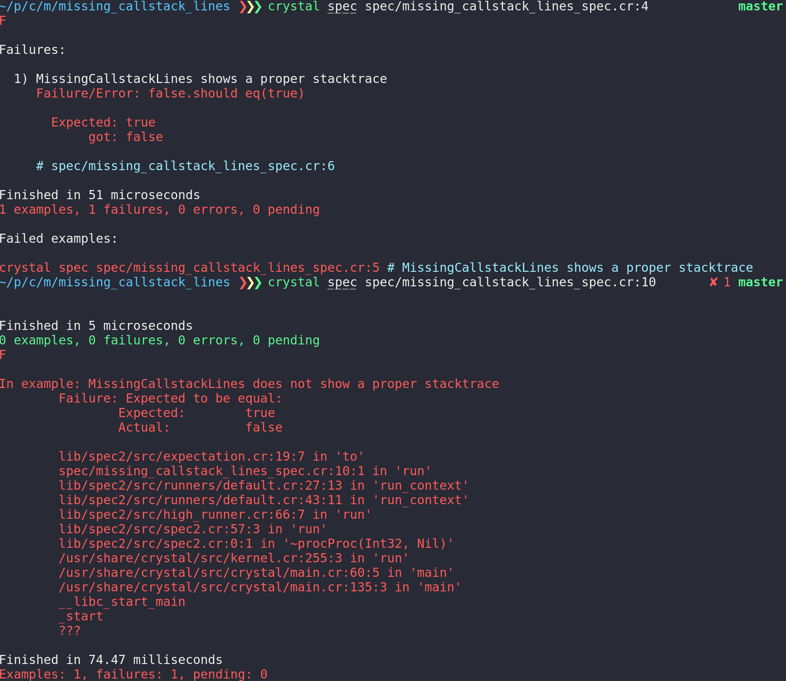

# missing_callstack_lines

This is just a small example to demonstrate [spec2.cr issue 62](https://github.com/waterlink/spec2.cr/issues/62).

Failed expectations won't show the proper line where the expectation actually failed.
In fact: everything but this line shown.

## Reproducing the issue

just call and compare

```bash
$ shards
$ crystal spec spec/missing_callstack_lines_spec.cr:4
$ crystal spec spec/missing_callstack_lines_spec.cr:10
```

This is the produced output:




```
$ crystal spec spec/missing_callstack_lines_spec.cr:4
F
Failures:
  1) MissingCallstackLines shows a proper stacktrace
     Failure/Error: false.should eq(true)
       Expected: true
            got: false
     # spec/missing_callstack_lines_spec.cr:6
Finished in 53 microseconds
1 examples, 1 failures, 0 errors, 0 pending
Failed examples:
crystal spec spec/missing_callstack_lines_spec.cr:5 # MissingCallstackLines shows a proper stacktrace

$ crystal spec spec/missing_callstack_lines_spec.cr:10
Finished in 5 microseconds
0 examples, 0 failures, 0 errors, 0 pending
F
In example: MissingCallstackLines does not show a proper stacktrace
        Failure: Expected to be equal:
                Expected:        true
                Actual:          false
        lib/spec2/src/expectation.cr:19:7 in 'to'
        spec/missing_callstack_lines_spec.cr:10:1 in 'run'
        lib/spec2/src/runners/default.cr:27:13 in 'run_context'
        lib/spec2/src/runners/default.cr:43:11 in 'run_context'
        lib/spec2/src/high_runner.cr:66:7 in 'run'
        lib/spec2/src/spec2.cr:57:3 in 'run'
        lib/spec2/src/spec2.cr:0:1 in '~procProc(Int32, Nil)'
        /usr/share/crystal/src/kernel.cr:255:3 in 'run'
        /usr/share/crystal/src/crystal/main.cr:60:5 in 'main'
        /usr/share/crystal/src/crystal/main.cr:135:3 in 'main'
        __libc_start_main
        _start
        ???
Finished in 90.79 milliseconds
Examples: 1, failures: 1, pending: 0
```
